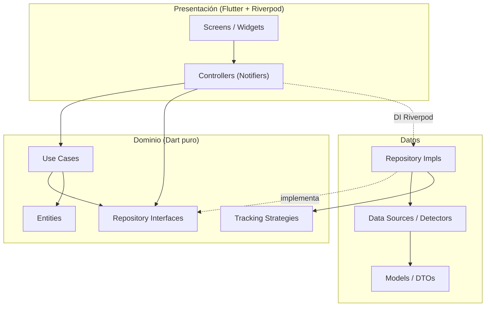
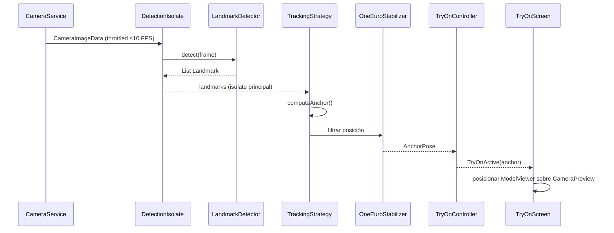
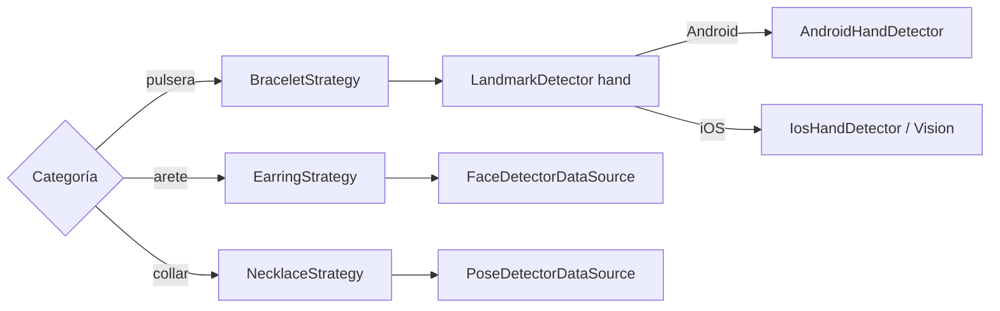

# Arquitectura de la aplicación — Visualización virtual de joyería con Realidad Aumentada

**Estado:** Documento técnico interno *as-built* (refleja el código en el repositorio) · **Última actualización:** 2026-08-23  
**Base tecnológica:** Flutter · Dart 3.11 · Material 3  
**Decisiones marco:** Riverpod (estado + DI) · Clean Architecture *feature-first* · datos locales · Strategy de anclaje por categoría

> Documento técnico interno. Describe la arquitectura **implementada** del producto (aretes, pulseras y collares). Plataformas: Android 9.0 (API 28)+ e iOS 16.0+.
>
> **Separación framework vs. diseño propio (SDD §2.3):** exposición académica (Flutter vs. aplicación, patrones, tácticas, escenarios de calidad y **única fuente de verdad de los ADR**): [`SDD_2.3_ARQUITECTURA_DEL_SISTEMA.md`](SDD_2.3_ARQUITECTURA_DEL_SISTEMA.md). Este archivo no duplica la tabla ADR; solo enlaza.

---

## 1. Objetivos de calidad (drivers arquitectónicos)

| # | Atributo | Por qué es crítico aquí | Cómo lo aborda la arquitectura |
|---|---|---|---|
| 1 | **Rendimiento en tiempo real** | `detect()` cuesta ~15–40 ms/frame; sin isolate la UI llega a 0 FPS (spike B5). | `DetectionIsolate` + throttling ≤10 FPS de detección + One Euro. |
| 2 | **Portabilidad Android/iOS** | Manos: JNI Android vs. Apple Vision iOS; Face/Pose: ML Kit en ambos. | `LandmarkDetector` + adapters por plataforma; dominio agnóstico. |
| 3 | **Extensibilidad por categoría** | Muñeca, lóbulo y hombros usan técnicas distintas. | `TrackingStrategy` por categoría. |
| 4 | **Testabilidad** | Evidencia de tesis sin dispositivo para dominio/filtros. | Dominio Dart puro; pruebas de estrategias. |
| 5 | **Mantenibilidad (equipo de 4)** | Trabajo paralelo sin pisarse. | *Feature-first*: `catalog`, `tracking`, `ar_experience`. |
| 6 | **Evolutividad del catálogo** | Hoy local; posible remoto después. | `CatalogRepository` como frontera. |

Escenarios medibles (estímulo → respuesta → medida): ver SDD §2.6.1.

---

## 2. Restricciones

- **Framework fijo:** Flutter/Dart.
- **Render de la prueba virtual (flujo principal):** `CameraPreview` + overlay de GLB vía `model_viewer_plus`. **No** usa `ARNode` / hit-test de ARCore/ARKit para el anclaje anatómico.
- **`ar_flutter_plugin_2`:** permanece en el `pubspec` (visor/colocación sobre superficie heredada de la validación previa); **no** participa en el pipeline de anclaje corporal. ARCore/ARKit están declarados como *optional* en el manifest.
- **Dispositivo físico** para cámara + tracking (no emulador/simulador).
- **Plugins nativos:** `hand_landmarker` (JNI), ML Kit (platform channels), Vision en iOS (channel propio).
- **Formato de modelos:** GLB (glTF 2.0, PBR). Ver `D1_PIPELINE_DIGITALIZACION.md`.
- **Datos locales** este semestre: `catalog.json` y GLB como *assets*.

---

## 3. Estilo arquitectónico

**Clean Architecture** con tres capas y organización **feature-first**. Las dependencias apuntan **hacia el dominio**.



- **Dominio:** entidades, contratos, casos de uso de catálogo, estrategias. Sin Flutter ni plugins.
- **Datos:** repositorios, detectores, parsing JSON.
- **Presentación:** pantallas y controllers. No calcula anclajes.
- **`core`:** cámara, permisos, isolate, filtros One Euro, geometría (`Vec3`), channels, DI.

---

## 4. Estructura de carpetas (as-built)

Solo se listan rutas que **existen** en el repositorio.

```
lib/
├── main.dart
├── app/
│   ├── app.dart
│   ├── router.dart                 # / → CatalogScreen; /try-on/:pieceId → TryOnScreen
│   └── theme.dart
├── core/
│   ├── error/{failure, result}.dart
│   ├── camera/camera_service.dart
│   ├── permissions/permission_service.dart
│   ├── isolate/detection_isolate.dart    # factory de detector + SendPort (B5)
│   ├── filters/
│   │   ├── one_euro_filter.dart
│   │   └── landmark_stabilizer.dart      # OneEuroStabilizer (Kalman quedó en spikes/B4)
│   ├── platform/platform_channels.dart
│   ├── math/geometry.dart                # Vec3 (proyección pantalla/mm: pendiente, ver §6.5)
│   └── di/providers.dart
├── features/
│   ├── catalog/
│   │   ├── domain/entities/{jewelry_piece, jewelry_category}.dart
│   │   ├── domain/repositories/catalog_repository.dart
│   │   ├── domain/usecases/{load_catalog, get_pieces_by_category}.dart
│   │   ├── data/models/jewelry_piece_model.dart
│   │   ├── data/datasources/catalog_local_datasource.dart
│   │   ├── data/repositories/catalog_repository_impl.dart
│   │   └── presentation/{controllers/catalog_controller, screens/catalog_screen, widgets/piece_card}.dart
│   ├── tracking/
│   │   ├── domain/entities/{landmark, anchor_pose}.dart
│   │   ├── domain/repositories/tracking_repository.dart
│   │   ├── domain/strategies/
│   │   │   ├── tracking_strategy.dart          # + enum DetectorKind
│   │   │   ├── bracelet_strategy.dart
│   │   │   ├── earring_strategy.dart
│   │   │   └── necklace_strategy.dart
│   │   └── data/
│   │       ├── datasources/
│   │       │   ├── landmark_detector.dart      # interfaz (no hand_detector.dart)
│   │       │   ├── android_hand_detector.dart
│   │       │   ├── ios_hand_detector.dart
│   │       │   ├── face_detector_datasource.dart
│   │       │   └── pose_detector_datasource.dart
│   │       └── repositories/tracking_repository_impl.dart
│   └── ar_experience/
│       └── presentation/
│           ├── controllers/try_on_controller.dart   # Facade de sesión
│           └── screens/try_on_screen.dart           # CameraPreview + ModelViewer overlay
```

**No existen** (fueron propuesta previa, no implementar como si estuvieran): `kalman_filter.dart` en `core/`, `tracking_frame.dart`, `stream_anchor_pose.dart`, `hand_detector.dart`, `compose_scene.dart`, `tracking_controller.dart`, `shared/widgets/`, widgets `ar_view` / `landmark_overlay` / `try_on_hud`.

---

## 5. Capa de dominio (contratos alineados al código)

```dart
class Landmark {
  final double x, y, z;      // contrato: x,y normalizados [0,1]; z profundidad relativa
  final double? visibility;
  const Landmark(this.x, this.y, this.z, {this.visibility});
}

class AnchorPose {
  final Vec3 position;
  final double rollRadians;  // orientación en el plano (no Quaternion)
  final double confidence;
  const AnchorPose({required this.position, this.rollRadians = 0, this.confidence = 1});
}

abstract interface class TrackingStrategy {
  JewelryCategory get category;
  DetectorKind get detectorKind; // hand | face | pose
  AnchorPose? computeAnchor(List<Landmark> landmarks);
}

abstract interface class TrackingRepository {
  Stream<AnchorPose> anchorPoseStream(JewelryCategory category);
  Future<void> stop();
}
```

| Estrategia | Detector | Anclaje |
|---|---|---|
| `BraceletStrategy` | `hand` | Landmark 0 (muñeca); **`rollRadians` no estimado** (queda en `0`) |
| `EarringStrategy` | `face` | Lóbulo estimado (oreja + *drop* interocular); roll desde línea de ojos |
| `NecklaceStrategy` | `pose` | Medio de hombros 11/12 + *drop*; roll desde línea de hombros; exige `visibility ≥ 0.5` |

> **Hueco de diseño:** aretes y collares rotan el anclaje con la anatomía; la pulsera no sigue el giro de la muñeca. Trabajo abierto en SDD Parte D.

---

## 6. Pipeline de tracking y render

### 6.1 Flujo en tiempo real (as-built)



### 6.2 Selección categoría → detector → plataforma



- Pulsera → cámara **trasera**; arete/collar → **frontal**.
- Formato de imagen vía `imageFormatGroupFor(DetectorKind)`: en **Android**, `yuv420` (manos) vs `nv21` (ML Kit Face/Pose); en **iOS**, ambos caminos usan `bgra8888`.

### 6.3 Isolate de detección

Toda sesión de tracking crea un `DetectionIsolate` con su propia instancia del detector (`_createDetector` = Factory Method según `DetectorKind` + plataforma). ML Kit inicializa `BackgroundIsolateBinaryMessenger` dentro del isolate.

**Estado actual:** la detección **siempre** corre en isolate (ya no hay bifurcación isolate vs. hilo principal en `TrackingRepositoryImpl`).

### 6.4 Estabilización

`OneEuroStabilizer` en `core/filters/` (promovido desde spike B4). Parámetros iniciales: `minCutoff=1.0`, `beta=0.02`, `dCutoff=1.0`. Kalman permanece solo en `spikes/B4-estabilizacion/` como evidencia comparativa.

### 6.5 Espacio de coordenadas (deuda / defecto abierto)

| Etapa | Contrato | Estado |
|---|---|---|
| Landmark (x, y) | Normalizado [0, 1] en el frame | **Roto en Face/Pose:** se divide por ancho/alto del buffer **sin compensar rotación del sensor**, lo que puede producir coordenadas fuera de [0,1] y desplazar aretes/collares |
| Landmark (z) | Profundidad relativa | Pose deja `z` en escala cruda de ML Kit (no afecta el overlay 2D actual) |
| Overlay | `left/top = position.x/y * areaSize` | Implementado en `TryOnScreen` |
| Escala mm → tamaño en pantalla | Dimensiones del catálogo | **No implementado** (`geometry.dart` solo tiene `Vec3`) |

Prioridad **Alta**: corregir normalización con rotación en Face/Pose y documentar la cadena completo como dominio (ver SDD §2.9).

### 6.6 Pérdida de tracking (comportamiento actual)

Hoy, si `computeAnchor` devuelve `null` o un frame falla, **no se emite** una nueva pose: el controlador conserva la última `TryOnActive(anchor: …)` hasta que llegue otra válida. No hay TTL, fade-out ni umbral unificado de confianza. Política objetivo: SDD §2.6.2.

---

## 7. Gestión de estado con Riverpod

Providers reales en `core/di/providers.dart`:

- `permissionServiceProvider`, `cameraServiceProvider`
- `catalogLocalDataSourceProvider`, `catalogRepositoryProvider`
- `trackingStrategiesProvider` → mapa categoría → estrategia
- `trackingRepositoryProvider` → `TrackingRepositoryImpl(cameraService, strategies)`  
  (el detector **no** se inyecta aquí; lo instancia el isolate)

```dart
sealed class TryOnState { const TryOnState(); }
class TryOnIdle extends TryOnState { … }
class TryOnRequestingPermission extends TryOnState { … }
class TryOnPermissionDenied extends TryOnState { … }
class TryOnUnsupported extends TryOnState { … }  // reason
class TryOnActive extends TryOnState {             // sin JewelryPiece
  final AnchorPose? anchor;
  final double fps;
  …
}
class TryOnError extends TryOnState { … }
```

La pieza se resuelve en `TryOnScreen` desde el catálogo por `pieceId` de la ruta; el controller solo orquesta permiso → *stream* → stop.

---

## 8. Modelo de datos y catálogo

- Fuente: `assets/catalog/catalog.json` (`D3_ESTRUCTURA_CATALOGO.md`).
- Si el GLB de la pieza no está en el bundle, `TryOnScreen` usa **fallback** `assets/models/_placeholder.glb`.

---

## 9. Navegación, permisos y errores

- **Rutas:** `/`, `/try-on/:pieceId` (`go_router`).
- **Permisos:** `PermissionService` (incluye `permanentlyDenied` → Ajustes).
- **Errores:** `Result`/`Failure` en core; sesión → `TryOnError` / `TryOnPermissionDenied` / `TryOnUnsupported`.
- **Ciclo de vida:** `anchorPoseStream` llama `stop()` antes de abrir sesión nueva; `TryOnController` libera en `onDispose` y en `stop()` (ack del isolate en iOS antes de `kill`).

---

## 10. Estrategia de pruebas

| Nivel | Qué | Herramienta | Dispositivo |
|---|---|---|---|
| Unitaria dominio | Estrategias de anclaje | `dart test` | No |
| Unitaria core | One Euro / estabilizador (spike B4 + producción) | `dart test` | No |
| Widget | Catálogo / shell | `flutter_test` | No |
| E2E | Cámara + detección + overlay | Manual | Sí (Android e iOS ya validados en flujo básico) |

---

## 11. Dependencias (stack en uso)

| Paquete | Rol |
|---|---|
| `flutter_riverpod` | Estado + DI |
| `go_router` | Navegación |
| `camera` / `permission_handler` | Captura y permisos |
| `camera_platform_interface` | Tipos serializables (`CameraImageData`) para el isolate de detección (B5) |
| `hand_landmarker` | Manos Android |
| `google_mlkit_face_detection` / `pose_detection` | Aretes / collares |
| `model_viewer_plus` | Overlay GLB en prueba virtual |
| `ar_flutter_plugin_2` | Presente; no usado en el pipeline de anclaje corporal (ver ADR-09 en el SDD: costo nativo en el APK) |
| `vector_math`, `logger`, `mocktail` | Matemática / logs / tests |

Code-gen (`freezed`, `riverpod_generator`) **no** adoptado aún (clases Dart planas).

---

## 12. Decisiones de arquitectura (ADR)

**Fuente única:** [`SDD_2.3_ARQUITECTURA_DEL_SISTEMA.md`](SDD_2.3_ARQUITECTURA_DEL_SISTEMA.md) §2.8 (ADR-01 … ADR-12).  
No se replica la tabla aquí para evitar divergencia entre documentos.

---

## 13. Mapa spikes / frentes → código (estado)

| Ítem | Ubicación | Estado |
|---|---|---|
| B1 / C2 manos iOS | `ios_hand_detector.dart` + `HandTrackingHandler.swift` | Hecho, validado en iPhone |
| B2 collares | `pose_detector_datasource.dart` + `NecklaceStrategy` | Funcional; falta protocolo de precisión + fix coords (§6.5) |
| B3 / C1 aretes | `face_detector_datasource.dart` + `EarringStrategy` + `TryOnScreen` | Funcional; idem coords |
| B4 estabilización | `core/filters/` | Hecho |
| B5 isolate | `core/isolate/detection_isolate.dart` | Hecho; siempre en isolate |
| D3 catálogo | `features/catalog` + `catalog.json` | Esquema hecho; GLB reales = D2 pendiente |

---

## 14. Adopción — estado de los siete pasos

| # | Paso | Estado |
|---|---|---|
| 1 | Scaffolding feature-first + providers | ✅ Hecho |
| 2 | Core: filtros, cámara, permisos | ✅ Hecho |
| 3 | Feature `catalog` | ✅ Hecho |
| 4 | Feature `tracking` + isolate | ✅ Hecho |
| 5 | `TryOnScreen` overlay estabilizado | ✅ Hecho |
| 6 | Aretes y collares | ✅ Funcional en dispositivo (deuda §6.5 / precisión) |
| 7 | Paridad iOS (manos) | ✅ Hecho |

Pendiente de producto/arquitectura abierta: corrección del espacio de coordenadas (Alta), roll de pulsera (Alta), política de degradación al perder tracking, decisión sobre `ar_flutter_plugin_2`, modelos GLB reales (D2), escenarios de calidad medidos en dispositivo (complementar B5).

---

## 15. Criterio de mantenimiento de este documento

- [ ] Toda afirmación de estructura o API debe existir en `lib/` (o marcarse explícitamente como *propuesta*).
- [ ] El render del flujo principal se describe como **overlay**, no como `ARNode`, salvo que el código cambie.
- [ ] Los ADR se editan **solo** en el SDD §2.8; aquí únicamente el enlace.
- [ ] Tras cambios de pipeline, actualizar §§4–7 y el diagrama de §6.1 en el mismo PR/commit de documentación.
