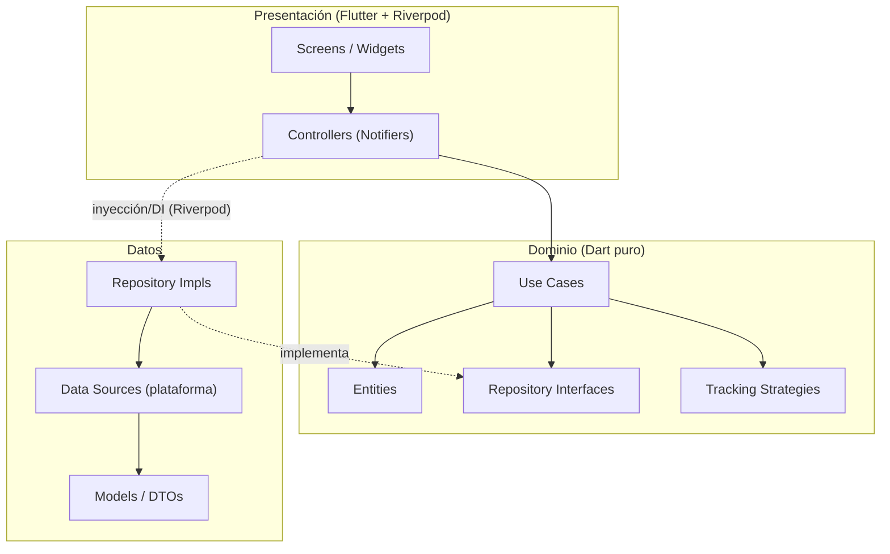
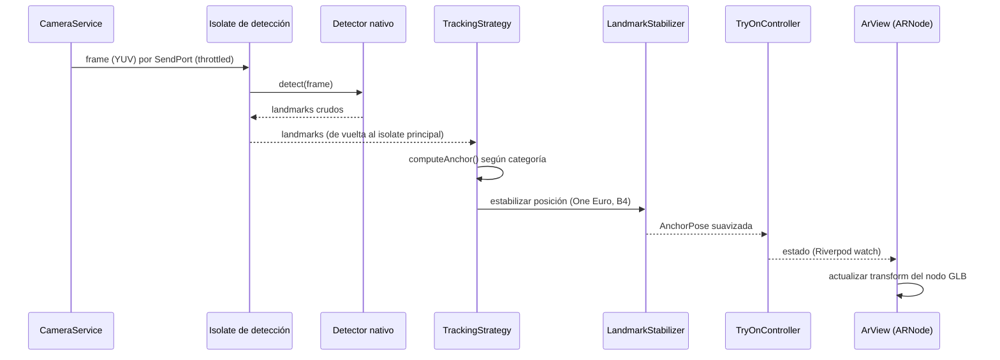
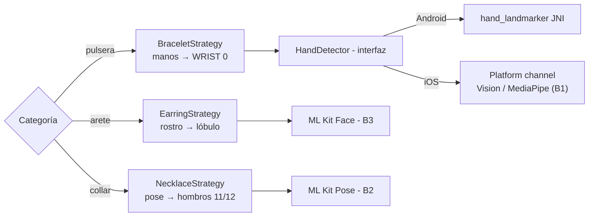

# Arquitectura de la aplicación — Visualización virtual de joyería con Realidad Aumentada

**Estado:** Propuesta para revisión del equipo · **Última actualización:** 2026-08-09
**Base tecnológica:** Flutter · Dart 3.11 · Material 3
**Decisiones marco:** Riverpod (estado + inyección de dependencias) · Clean Architecture *feature-first* · datos locales

> Documento técnico interno. Define la arquitectura del producto (no de la validación técnica previa, que era un laboratorio de pantallas sueltas). Alcance del producto: **aretes, pulseras y collares**. Plataformas: Android 9.0 (API 28)+ e iOS 16.0+.

---

## 1. Objetivos de calidad (drivers arquitectónicos)

La arquitectura se justifica por los atributos de calidad que el producto exige. En orden de prioridad:

| # | Atributo | Por qué es crítico aquí | Cómo lo aborda la arquitectura |
|---|---|---|---|
| 1 | **Rendimiento en tiempo real** | La detección de landmarks bloquea el isolate (~15–40 ms/frame → ≤10 FPS). El anclaje debe verse fluido. | Isolate de detección dedicado (spike B5); throttling; estabilización con One Euro (B4). |
| 2 | **Portabilidad Android/iOS** | El detector de manos difiere por plataforma (`hand_landmarker` es Android-only; iOS requiere solución nativa, spike B1). | Detectores tras interfaces; implementación por plataforma inyectada; dominio agnóstico. |
| 3 | **Extensibilidad por categoría** | Tres técnicas de anclaje distintas (muñeca, lóbulo, hombros) y potencialmente más piezas/categorías. | Patrón *Strategy* de tracking por categoría; catálogo dirigido por datos. |
| 4 | **Testabilidad** | Es una tesis: la lógica de dominio y los filtros deben poder probarse sin dispositivo. | Dominio en Dart puro sin dependencias de Flutter; filtros ya cubiertos por pruebas (B4). |
| 5 | **Mantenibilidad por un equipo de 4** | Trabajo paralelo en sprints sin pisarse. | Organización *feature-first*: cada feature es un módulo con sus tres capas. |
| 6 | **Evolutividad hacia remoto** | Hoy el catálogo es local, pero la joyería podría actualizarlo en el futuro. | Repositorios como frontera; cambiar a remoto no toca dominio ni presentación. |

---

## 2. Restricciones

- **Framework fijo:** Flutter/Dart (ya validado). Renderizado AR mediante `ar_flutter_plugin_2` (ARCore/ARKit) y visor con `model_viewer_plus`.
- **AR solo en dispositivo físico** (no emulador/simulador).
- **Plugins con acoplamiento nativo:** `hand_landmarker` (JNI, Android), ML Kit (platform channels). Esto condiciona qué puede ejecutarse dentro de un isolate secundario (ver §6.3).
- **Formato de modelos:** GLB (glTF 2.0, PBR). Ver `D1_PIPELINE_DIGITALIZACION.md`.
- **Datos locales** este semestre: `catalog.json` y GLB empaquetados como *assets*.

---

## 3. Estilo arquitectónico

**Clean Architecture** con tres capas y **organización por feature**. La regla de dependencia es estricta: las flechas de dependencia apuntan **hacia el dominio**; el dominio no conoce a nadie.



- **Dominio:** entidades, contratos de repositorio, casos de uso y estrategias. **Sin imports de Flutter** → se prueba con `dart test` puro.
- **Datos:** implementaciones de los repositorios, *data sources* específicos de plataforma y DTOs (parsing JSON, conversión de tipos de plugins).
- **Presentación:** pantallas, widgets y *controllers* de Riverpod. Solo depende del dominio.
- **`core`** (transversal): cámara, permisos, isolate de detección, filtros, canales nativos, geometría, tema, routing y providers raíz. No depende de ninguna feature.

---

## 4. Estructura de carpetas

```
lib/
├── main.dart                       # runApp(ProviderScope(child: App()))
├── app/
│   ├── app.dart                    # MaterialApp.router + tema
│   ├── router.dart                 # go_router
│   └── theme.dart
├── core/                           # transversal, sin dependencias de features
│   ├── error/
│   │   ├── failure.dart            # jerarquía de fallos
│   │   └── result.dart             # Result<T> (sealed) para el flujo de errores
│   ├── camera/camera_service.dart  # configuración y stream de cámara
│   ├── permissions/permission_service.dart
│   ├── isolate/detection_isolate.dart   # infraestructura del isolate (spike B5)
│   ├── filters/                    # (proveniente de spike B4)
│   │   ├── one_euro_filter.dart
│   │   ├── kalman_filter.dart
│   │   └── landmark_stabilizer.dart
│   ├── platform/platform_channels.dart  # nombres de canales nativos (iOS, B1)
│   ├── math/geometry.dart          # Vec3, proyección normalizada→pantalla→AR
│   └── di/providers.dart           # providers raíz (servicios y configuración)
├── features/
│   ├── catalog/                    # piezas de joyería y sus metadatos (D3)
│   │   ├── domain/
│   │   │   ├── entities/jewelry_piece.dart
│   │   │   ├── entities/jewelry_category.dart
│   │   │   ├── repositories/catalog_repository.dart
│   │   │   └── usecases/{load_catalog, get_pieces_by_category}.dart
│   │   ├── data/
│   │   │   ├── models/jewelry_piece_model.dart      # DTO + fromJson
│   │   │   ├── datasources/catalog_local_datasource.dart
│   │   │   └── repositories/catalog_repository_impl.dart
│   │   └── presentation/
│   │       ├── controllers/catalog_controller.dart
│   │       ├── screens/catalog_screen.dart
│   │       └── widgets/piece_card.dart
│   ├── tracking/                   # detección de landmarks → punto de anclaje
│   │   ├── domain/
│   │   │   ├── entities/{landmark, anchor_pose, tracking_frame}.dart
│   │   │   ├── repositories/tracking_repository.dart
│   │   │   ├── strategies/tracking_strategy.dart    # interfaz + una por categoría
│   │   │   │   ├── bracelet_strategy.dart           # manos → WRIST (0)
│   │   │   │   ├── earring_strategy.dart            # rostro → lóbulo (B3)
│   │   │   │   └── necklace_strategy.dart           # pose → hombros 11/12 (B2)
│   │   │   └── usecases/stream_anchor_pose.dart
│   │   ├── data/
│   │   │   ├── datasources/
│   │   │   │   ├── hand_detector.dart               # interfaz
│   │   │   │   ├── android_hand_detector.dart       # hand_landmarker (JNI)
│   │   │   │   ├── ios_hand_detector.dart           # platform channel (B1)
│   │   │   │   ├── face_detector_datasource.dart    # ML Kit Face (B3)
│   │   │   │   └── pose_detector_datasource.dart    # ML Kit Pose (B2)
│   │   │   └── repositories/tracking_repository_impl.dart
│   │   └── presentation/controllers/tracking_controller.dart
│   └── ar_experience/              # une catálogo + tracking + render AR
│       ├── domain/usecases/compose_scene.dart
│       └── presentation/
│           ├── controllers/try_on_controller.dart  # orquesta el flujo completo
│           ├── screens/try_on_screen.dart          # parametrizada por categoría
│           └── widgets/{ar_view, landmark_overlay, try_on_hud}.dart
└── shared/
    └── widgets/                    # UI reutilizable (badges, paneles de estado)
```

**Racional del *feature-first*:** cada integrante puede trabajar una feature (catálogo, tracking, experiencia AR) sin colisionar con las demás; los contratos entre features viven en el dominio.

---

## 5. Capa de dominio (contratos clave)

Dart puro. Estas son las abstracciones centrales; la lógica concreta vive en `data/`.

```dart
// entities/landmark.dart
class Landmark {
  final double x, y, z;      // x,y normalizados [0,1]; z profundidad relativa
  final double? visibility;  // confianza (ML Kit Pose la provee; MediaPipe no)
  const Landmark(this.x, this.y, this.z, {this.visibility});
}

// entities/anchor_pose.dart — resultado agnóstico de plataforma que consume el render
class AnchorPose {
  final Vec3 position;       // punto de anclaje ya estabilizado
  final Quaternion rotation; // orientación estimada de la pieza
  final double confidence;
  const AnchorPose(this.position, this.rotation, this.confidence);
}

// strategies/tracking_strategy.dart — Strategy por categoría
abstract class TrackingStrategy {
  JewelryCategory get category;
  /// Detector que necesita esta categoría (manos / rostro / pose).
  DetectorKind get detectorKind;
  /// Transforma los landmarks crudos en el punto y orientación de anclaje.
  AnchorPose? computeAnchor(List<Landmark> landmarks);
}

// repositories/tracking_repository.dart — frontera hacia la capa de datos
abstract class TrackingRepository {
  /// Emite poses de anclaje estabilizadas para la categoría dada, a partir
  /// del stream de cámara. La selección de detector (plataforma) y el isolate
  /// quedan ocultos tras esta interfaz.
  Stream<AnchorPose> anchorPoseStream(JewelryCategory category);
  Future<void> stop();
}
```

`BraceletStrategy` toma el landmark 0 (WRIST) y estima la orientación con los landmarks vecinos; `NecklaceStrategy` promedia los hombros (11, 12) para el punto base del collar; `EarringStrategy` usa el/los landmark(s) de lóbulo que defina el spike **B3**. Añadir una categoría = añadir una estrategia, sin tocar el resto.

---

## 6. Subsistema central: pipeline de tracking y AR

Es el corazón del producto y donde se concentran los riesgos técnicos. Se diseña como una tubería con fronteras claras.

### 6.1 Flujo en tiempo real



### 6.2 Selección de detector (Strategy + plataforma)



La categoría decide la estrategia; la estrategia declara el detector que necesita; la **plataforma** decide la implementación concreta del detector. El dominio nunca ve un `CameraImage` ni un tipo de plugin.

### 6.3 Isolate de detección (rendimiento, spike B5)

`detect()` es síncrono y bloquea el isolate principal. `core/isolate/detection_isolate.dart` encapsula un isolate dedicado con su propia instancia del detector; los frames se envían por `SendPort` y regresan los landmarks.

> **Restricción documentada:** los detectores basados en *platform channels* (ML Kit) requieren inicializar `BackgroundIsolateBinaryMessenger` con el `RootIsolateToken` dentro del isolate. `hand_landmarker` (JNI directo) es más autónomo. Por eso el detector se define tras una interfaz y el `TrackingRepositoryImpl` decide si corre en isolate o en el hilo principal con throttling, según el detector. La medición de FPS antes/después es el criterio de cierre de B5.

### 6.4 Estabilización (spike B4, ya resuelto)

El pipeline aplica `LandmarkStabilizer` (One Euro Filter recomendado) al punto de anclaje antes de entregarlo al render. El código y la comparación viven en `spikes/B4-estabilizacion/` y se promoverán a `core/filters/`.

---

## 7. Gestión de estado con Riverpod

Riverpod cumple doble rol: **inyección de dependencias** (reemplaza a `get_it`) y **estado reactivo**.

- **Providers de infraestructura** (`core/di/providers.dart`): `cameraServiceProvider`, `permissionServiceProvider`, detectores según `Platform`.
- **Providers de repositorio:** enlazan la interfaz de dominio con su implementación de datos.

```dart
final catalogRepositoryProvider = Provider<CatalogRepository>(
  (ref) => CatalogRepositoryImpl(ref.watch(catalogLocalDataSourceProvider)),
);

final trackingRepositoryProvider = Provider<TrackingRepository>((ref) {
  final detector = ref.watch(handDetectorProvider); // Android o iOS según plataforma
  return TrackingRepositoryImpl(
    detector: detector,
    stabilizer: OneEuroStabilizer(minCutoff: 1.0, beta: 0.02),
  );
});
```

- **Controllers** (`Notifier`/`AsyncNotifier`) exponen estados inmutables. El estado de la experiencia de prueba, por ejemplo:

```dart
sealed class TryOnState { const TryOnState(); }
class TryOnLoading        extends TryOnState { const TryOnLoading(); }
class TryOnPermissionDenied extends TryOnState { const TryOnPermissionDenied(); }
class TryOnUnsupported     extends TryOnState { const TryOnUnsupported(this.reason); final String reason; }
class TryOnActive extends TryOnState {          // detectando y renderizando
  final JewelryPiece piece;
  final AnchorPose? anchor;
  final double fps;
  const TryOnActive({required this.piece, this.anchor, this.fps = 0});
}
class TryOnError extends TryOnState { const TryOnError(this.message); final String message; }
```

Los estados formalizan lo que en la validación previa era un `enum` ad hoc por pantalla, y lo hacen testeable con providers sobreescritos.

---

## 8. Modelo de datos y catálogo

- Fuente de verdad: `assets/catalog/catalog.json` (esquema en `D3_ESTRUCTURA_CATALOGO.md`).
- `CatalogLocalDataSource` lee el JSON de *assets*; `JewelryPieceModel.fromJson` lo convierte en DTO; el repositorio lo mapea a la entidad `JewelryPiece`.
- **Frontera de evolución:** cambiar a catálogo remoto = nueva `CatalogRemoteDataSource` + ajuste del repositorio. Dominio, controllers y UI **no cambian**.

---

## 9. Navegación, permisos y errores

- **Navegación:** `go_router` con rutas tipadas (catálogo → selección de pieza → experiencia AR por categoría). Reemplaza el mapa de rutas plano de la validación previa.
- **Permisos:** `PermissionService` centraliza el flujo de cámara (incluido el caso `permanentlyDenied` de iOS y el fix `PERMISSION_CAMERA=1` heredado). Ninguna pantalla vuelve a pedir permisos por su cuenta.
- **Errores:** `Result<T>` (sealed) en dominio/datos; los `Failure` se mapean a estados de UI (`TryOnError`, `TryOnUnsupported`). Nada de excepciones sin capturar cruzando capas.

---

## 10. Estrategia de pruebas

| Nivel | Qué se prueba | Herramienta | Requiere dispositivo |
|---|---|---|---|
| Unitaria (dominio) | Casos de uso, estrategias de anclaje, entidades | `dart test` | No |
| Unitaria (core) | Filtros de estabilización (B4 ya tiene banco), geometría | `dart test` | No |
| Repositorios | Impl con *data sources* simulados | `mocktail` | No |
| Widget | Pantallas con providers sobreescritos | `flutter_test` | No |
| Integración/E2E | Cámara + detección + render AR | Manual guiada | **Sí** |

La regla de dependencia garantiza que dominio y `core` (la mayor parte de la lógica) se prueben **sin** dispositivo — clave para la evidencia de la tesis.

---

## 11. Dependencias propuestas

Sobre el stack ya validado, se añaden:

| Paquete | Rol | Nota |
|---|---|---|
| `flutter_riverpod` | Estado + DI | Base de la arquitectura. |
| `riverpod_annotation` + `riverpod_generator` (dev) | Providers con code-gen | Opcional; reduce boilerplate. |
| `go_router` | Navegación declarativa | Rutas por feature. |
| `freezed` + `json_serializable` (dev) | Entidades inmutables + parsing | Igualdad/`copyWith` y `fromJson` del catálogo. |
| `google_mlkit_pose_detection` | Detección de pose (collares, B2) | Nuevo respecto a la validación previa. |
| `mocktail` (dev) | Mocks para pruebas | — |
| `logger` | Logging estructurado | Diagnóstico del pipeline. |

Se **conservan:** `ar_flutter_plugin_2`, `model_viewer_plus`, `camera`, `permission_handler`, `vector_math`, `google_mlkit_face_detection`, `hand_landmarker` (Android). No se requiere `get_it` (Riverpod cubre DI).

---

## 12. Decisiones de arquitectura registradas (ADR resumidas)

| ADR | Decisión | Motivo | Alternativas descartadas |
|---|---|---|---|
| 01 | **Riverpod** para estado y DI | Streams de cámara/detección, testabilidad, poco boilerplate | Bloc (más ceremonia), Provider/setState (no escala a AR) |
| 02 | **Clean Architecture *feature-first*** | Trabajo paralelo del equipo, testabilidad, defensa académica | Layered global, MVVM simple |
| 03 | **Datos locales tras repositorios** | Menor riesgo este semestre; frontera lista para remoto | Backend desde ya (sobre-ingeniería) |
| 04 | **Strategy de tracking por categoría** | Tres técnicas de anclaje heterogéneas y extensibles | `if/switch` por categoría en un servicio único |
| 05 | **Detectores tras interfaz + impl por plataforma** | `hand_landmarker` es Android-only; iOS pendiente (B1) | Acoplar la pantalla al plugin (como en la validación previa) |
| 06 | **Isolate de detección** | `detect()` bloquea el hilo principal | Detección síncrona en UI (≤10 FPS) |
| 07 | **One Euro Filter** para estabilización | Menos lag en movimiento (ver B4) | Kalman (más lag), sin filtro (jitter) |

---

## 13. Mapa de tareas pendientes → arquitectura

| Tarea | Dónde encaja |
|---|---|
| B1 (manos iOS) | `data/datasources/ios_hand_detector.dart` + `core/platform/platform_channels.dart` |
| B2 (pose collares) | `data/datasources/pose_detector_datasource.dart` + `NecklaceStrategy` |
| B3 (lóbulos aretes) | `data/datasources/face_detector_datasource.dart` + `EarringStrategy` |
| B4 (estabilización) | `core/filters/` (ya prototipado) |
| B5 (isolate) | `core/isolate/detection_isolate.dart` |
| C1 (pantalla aretes) | `features/ar_experience` con `EarringStrategy` |
| C2 (muñeca iOS) | integra B1 en `TrackingRepositoryImpl` |
| C3 (filtro en Android) | conecta `core/filters` al pipeline |
| D3 (catálogo) | `features/catalog` |

---

## 14. Ruta de adopción (del laboratorio al producto)

1. **Scaffolding**: crear el proyecto Flutter con esta estructura de carpetas, `pubspec` actualizado y providers raíz.
2. **Núcleo transversal**: portar `core/filters` (B4), `CameraService` y `PermissionService` (heredando la configuración validada de cámara/permisos).
3. **Feature `catalog`**: cargar `catalog.json` y listar piezas (dominio + datos + UI). Sin dispositivo.
4. **Feature `tracking`**: interfaz de detector + `AndroidHandDetector` (envuelve `hand_landmarker`) + `BraceletStrategy` + isolate (B5).
5. **Feature `ar_experience`**: `TryOnScreen` de pulseras integrando render AR + anclaje estabilizado (equivale a elevar la pantalla de manos de la validación previa a la arquitectura).
6. **Extensión por categoría**: aretes (B3/C1) y collares (B2), añadiendo estrategias y *data sources* sin tocar lo anterior.
7. **Paridad iOS**: `IosHandDetector` (B1/C2).

Cada paso es un incremento vertical (dominio→datos→UI) alineado con los sprints.

---

## 15. Criterio de cierre

- [ ] El equipo revisa y aprueba las decisiones marco (ADR §12).
- [ ] Se crea el scaffolding del proyecto conforme a §4.
- [ ] Cada tarea técnica pendiente tiene ubicación asignada en la estructura (§13).
