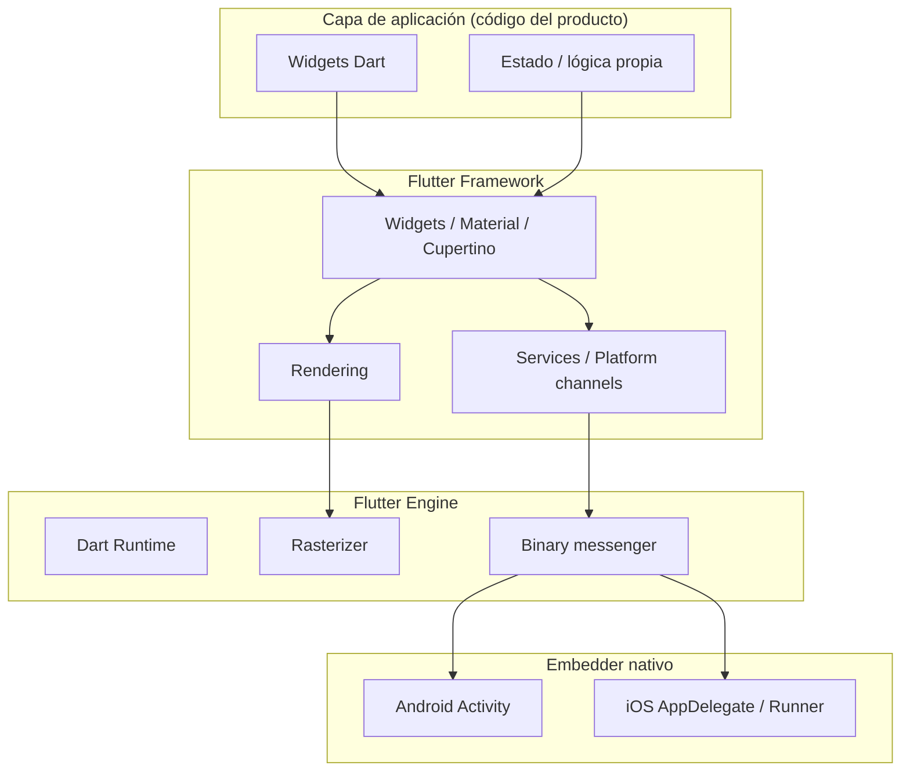
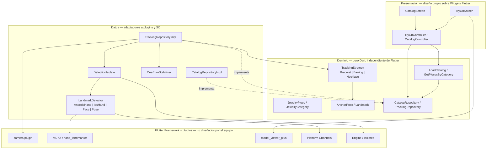
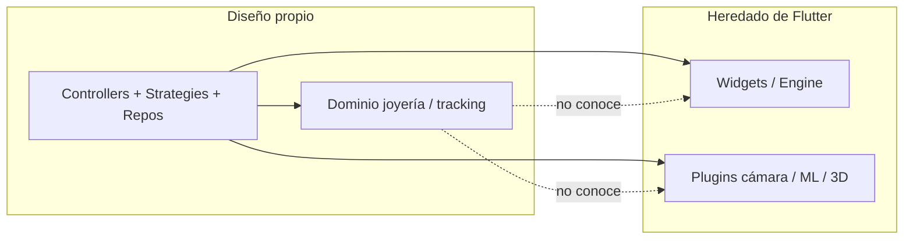

# 2.3. Arquitectura del sistema

**Documento:** Software Design Description (SDD) · Sección 2.3  
**Producto:** Visualización virtual de joyería con Realidad Aumentada  
**Última actualización:** 2026-08-23  
**Relacionado:** [`ARQUITECTURA.md`](ARQUITECTURA.md) (detalle *as-built* interno; **sin** tabla ADR duplicada), [`TAREAS_PENDIENTES.md`](TAREAS_PENDIENTES.md)

> **Criterio de esta sección (exigencia del SDD):** debe quedar explícito qué pertenece a la **arquitectura del framework Flutter** (genérica, heredada) y qué pertenece a la **arquitectura diseñada para esta aplicación de joyería**. Cada decisión de diseño incluye su justificación (*por qué*).

---

## Índice de cumplimiento del SDD

| # | Requisito del enunciado | Sección |
|---|---|---|
| 1 | Qué es Flutter | §1.1 |
| 2 | Cómo está estructurada su arquitectura | §1.2 |
| 3 | Componentes principales del framework | §1.3 |
| 4 | Cómo funcionan paquetes y dependencias | §1.4 |
| 5 | Diagrama de la arquitectura de Flutter | §1.5 |
| 6 | Diagrama de la arquitectura de la aplicación | §2.4 |
| 7 | Puntos de integración (qué de Flutter usa la app) | §3.1 |
| 8 | Relación entre componentes propios y los de Flutter | §3.2 |

---

# Parte A — Arquitectura del framework Flutter (genérica)

Esta parte describe el *suelo* tecnológico. **No es el diseño de la aplicación de joyería**; es el marco que Flutter ofrece a cualquier producto móvil.

## 1.1. Qué es Flutter

Flutter es un *framework* de interfaz de usuario multiplataforma, impulsado por Google, que permite construir aplicaciones nativas para Android, iOS (y otros objetivos) a partir de una base de código en el lenguaje **Dart**. Compila a código nativo (AOT en *release*) y dibuja la interfaz con su propio motor de renderizado (**Impeller** / Skia), sin depender de *WebViews* para los *widgets* propios.

**Por qué se eligió Flutter para este producto (decisión de producto, no de framework):**

| Motivo | Justificación en el dominio de joyería AR |
|---|---|
| Un solo código para Android e iOS | El alcance exige paridad en ambas plataformas (pulseras, aretes, collares). |
| Acceso a cámara y plugins nativos | La prueba virtual depende de *streams* de cámara y detectores ML por plataforma. |
| Ecosistema de paquetes | Existen integraciones maduras para cámara, permisos, ML Kit y visores 3D (GLB). |
| Rendimiento de UI | La superposición del modelo sobre la cámara exige un hilo de UI fluido (~60 FPS). |

## 1.2. Cómo está estructurada la arquitectura de Flutter

Flutter se organiza en capas concéntricas. De afuera hacia adentro:

1. **Framework (Dart):** *widgets*, *rendering*, *animation*, *gestures*, *services*. Es donde vive el código de UI de la aplicación.
2. **Engine (C/C++):** rasterización, tipografía, *dart runtime*, *platform channels* de bajo nivel.
3. **Embedder (plataforma):** Android (`FlutterActivity` / `FlutterFragmentActivity`), iOS (`FlutterAppDelegate` / *scene*), que hospeda el motor y conecta con el sistema operativo.

El modelo de UI es **declarativo** e **inmutable por *frame***: la aplicación describe un árbol de *widgets*; Flutter reconcilia cambios y repinta. El estado de la aplicación **no** lo impone Flutter: cada proyecto elige cómo gestionarlo (en este producto: Riverpod; ver Parte B).



## 1.3. Componentes principales del framework

| Componente | Rol en Flutter | ¿Lo “diseña” el equipo? |
|---|---|---|
| **Widget tree** | Describe la UI de forma declarativa | No: es del framework. El equipo solo elige *qué* widgets componer. |
| **Element / RenderObject** | Instancia y pinta el árbol | No. |
| **BuildContext / InheritedWidget** | Propagación de dependencias en el árbol | No (base). Riverpod se apoya encima. |
| **Platform channels** | Mensajes asíncronos Dart ↔ nativo | No el mecanismo; sí los *contratos* de canal propios (p. ej. manos en iOS). |
| **Isolates** | Concurrente en Dart (memoria aislada) | No el primitivo; sí la decisión de usarlo para detección ML. |
| **Plugin system** | Empaqueta código Dart + nativo | No; el equipo selecciona e integra plugins. |
| **Asset bundle** | Empaqueta recursos (JSON, GLB, imágenes) | No el mecanismo; sí el contenido del catálogo. |

## 1.4. Paquetes y dependencias

En Flutter, las dependencias se declaran en `pubspec.yaml`. Hay tres categorías relevantes:

| Tipo | Quién lo provee | Ejemplo en este proyecto |
|---|---|---|
| **SDK** | Flutter / Dart | `flutter`, `flutter_test` |
| **Plugin** | Paquete con código nativo | `camera`, `hand_landmarker`, `google_mlkit_*` |
| **Package puro Dart** | Solo Dart | `vector_math`, `logger`, parte de Riverpod |

**Ciclo de vida:** `flutter pub get` resuelve el grafo → en iOS CocoaPods / en Android Gradle incorporan el nativo → el *binary messenger* enlaza métodos Dart con implementaciones nativas.

**Decisión documentada:** las dependencias de *detección* y *render 3D* se tratan como **detalle de infraestructura** detrás de interfaces propias. Así, cambiar un plugin (p. ej. de MediaPipe a Vision en iOS) **no** redefine la arquitectura de dominio.

## 1.5. Diagrama — arquitectura Flutter (resumen visual)

Ver diagrama Mermaid de §1.2. En documentos Word/PDF del SDD puede sustituirse por el diagrama oficial de capas de Flutter (Framework → Engine → Embedder), citando la documentación del framework, y remitiendo a este apartado para la interpretación en el proyecto.

---

# Parte B — Arquitectura de la aplicación de joyería (diseño propio)

Esta parte es el **aporte arquitectónico del equipo**. Responde a un problema de dominio concreto: *anclar un modelo 3D de joya (arete, pulsera o collar) a un punto anatómico detectado en tiempo real, en Android e iOS, con catálogo local*.

## 2.1. Eje arquitectónico del dominio (qué hace “propia” esta arquitectura)

A diferencia de una app Flutter genérica (CRUD + pantallas), el diseño se organiza alrededor de **tres ejes de dominio**:

| Eje | Pregunta de diseño | Respuesta arquitectónica |
|---|---|---|
| **Categoría de joya** | ¿Dónde se ancla la pieza? | Patrón *Strategy* por categoría (muñeca / lóbulo / hombros). |
| **Pipeline de tracking** | ¿Cómo se obtiene una pose estable frame a frame? | Tubería: cámara → isolate → detector → estrategia → filtro → UI. |
| **Sesión de prueba virtual** | ¿Quién orquesta permiso, cámara, tracking y render? | *Facade* de presentación (`TryOnController`) + repositorio de tracking. |

**Por qué esto no es “solo Flutter”:** Flutter no conoce categorías de joyería, ni lóbulos, ni GLB de catálogo, ni el compromiso de FPS entre detección ML y UI. Esos conceptos y sus fronteras son diseño de producto.

## 2.2. Estilo arquitectónico elegido

**Clean Architecture con organización *feature-first***, implementada en Dart/Flutter.

| Capa | Contenido en este producto | Regla |
|---|---|---|
| **Dominio** | `JewelryPiece`, `AnchorPose`, `TrackingStrategy`, casos de uso, interfaces de repositorio | Dart puro; sin imports de Flutter ni de plugins ML |
| **Datos** | `*RepositoryImpl`, detectores Android/iOS, `catalog.json` | Implementa contratos; aísla plugins |
| **Presentación** | `CatalogScreen`, `TryOnScreen`, controllers Riverpod | Observa estado; no calcula anclajes |
| **Core (transversal)** | Cámara, permisos, isolate, filtros One Euro, geometría, DI | No depende de features |

**Por qué Clean Architecture *feature-first* y no “capas globales”:** el equipo es de cuatro personas y el dominio se parte naturalmente en *catálogo*, *tracking* y *experiencia AR*. Cada feature puede evolucionar sin reescribir las otras, siempre que respete contratos de dominio.

**Por qué no basta con “arquitectura Flutter”:** el framework solo organiza UI y plugins; no impone fronteras de dominio, estrategias de anclaje ni aislamiento de detectores por plataforma.

## 2.3. Vistas de arquitectura (4+1 ligeras, aterrizadas al producto)

### Vista lógica (dominio)

- **Catálogo:** piezas con categoría, tipo de anclaje, ruta GLB, dimensiones en mm.
- **Tracking:** landmarks → `AnchorPose` (posición estabilizada + orientación estimada + confianza).
- **Prueba virtual:** sesión que une una pieza del catálogo con un *stream* de poses.

### Vista de proceso (pipeline en tiempo real)

```
CameraService
    → DetectionIsolate (detector según categoría y SO)
        → TrackingStrategy.computeAnchor()
            → LandmarkStabilizer (One Euro)
                → TryOnController (estado)
                    → TryOnScreen (CameraPreview + ModelViewer superpuesto)
```

### Vista de desarrollo (módulos)

```
lib/app          → arranque Flutter (MaterialApp.router) — integración con el framework
lib/core         → infraestructura transversal del producto
lib/features/*
    catalog      → dominio joyería (metadatos)
    tracking     → dominio anatómico / ML
    ar_experience→ composición de la prueba virtual
```

### Vista física (despliegue)

- Binario Android (API 28+) e iOS (16+), dispositivo físico.
- Assets embebidos (`catalog.json`, GLB).
- Código nativo iOS adicional: `HandTrackingHandler.swift` (Apple Vision) registrado en el *embedder*.

## 2.4. Diagrama — arquitectura de la aplicación



**Lectura del diagrama:** todo lo que está bajo *Dominio* y los contratos *Strategy / Repository / Detector* es arquitectura de la aplicación. Todo lo sombreado como *Flutter Framework + plugins* es infraestructura heredada.

## 2.5. Catálogo de patrones de diseño (con justificación)

Cada patrón está **instanciado en el código** o propuesto como evolución inmediata (marcado ★).

| Patrón | Dónde vive | Problema del dominio que resuelve | Por qué (y no otra cosa) |
|---|---|---|---|
| **Strategy** | `TrackingStrategy` + `BraceletStrategy` / `EarringStrategy` / `NecklaceStrategy` | Tres categorías con anclaje anatómicamente distinto | Evita un `switch` monolítico; añadir categoría = nueva estrategia. Alternativa descartada: un solo servicio con `if` por categoría (frágil y no testeable por unidad de anclaje). |
| **Adapter** | `AndroidHandDetector`, `IosHandDetector`, `FaceDetectorDataSource`, `PoseDetectorDataSource` frente a `LandmarkDetector` | Plugins y APIs nativas incompatibles entre sí y entre SO | El dominio solo ve `List<Landmark>`. Alternativa descartada: acoplar `TryOnScreen` a `hand_landmarker` (imposible en iOS). |
| **Repository** | `CatalogRepository`, `TrackingRepository` | Aislar origen de datos (JSON local hoy; remoto mañana) y origen de poses | Frontera evolutiva. Alternativa descartada: leer `catalog.json` desde la UI. |
| **Pipes and Filters** (pipeline) | `TrackingRepositoryImpl`: frame → detect → computeAnchor → stabilize → emitir | El tracking es una tubería de transformaciones sobre el frame | Hace explícitas las etapas medibles (latencia, FPS). Alternativa descartada: “god class” de AR que mezcla cámara, ML y UI. |
| **Facade** | `TryOnController` | La UI no debe conocer permisos + cámara + isolate + estrategias | Un solo `start(category)` / `stop()`. Alternativa descartada: la pantalla llama a cada servicio. |
| **Factory Method** | `DetectionIsolate` al instanciar el detector según `DetectorKind` + plataforma | Crear el detector correcto dentro del isolate | Centraliza la matriz categoría×SO. Alternativa descartada: `if (Platform.isIOS)` dispersos en presentación. |
| **Observer** (reactivo) | *Streams* de `AnchorPose` + Riverpod | La UI debe reaccionar a poses a ~10 Hz sin *polling* | Encaja con cámara y ML asíncronos. Alternativa descartada: `setState` manual por *timer*. |
| **Dependency Injection** | Providers en `core/di/providers.dart` | Sustituir implementaciones en pruebas y por plataforma | Testabilidad académica y paridad Android/iOS. Alternativa descartada: singletons globales / `get_it` adicional (Riverpod ya cubre DI). |
| **State pattern** (estados sellados) | `TryOnState` (`Idle`, `PermissionDenied`, `Active`, …) | La sesión de prueba tiene modos excluyentes | Formaliza UX y errores. Alternativa descartada: booleanos sueltos (`isLoading && hasError`). |
| **Fallback (valor por defecto)** | `_placeholder.glb` cuando falta el GLB de la pieza | No bloquear la validación del pipeline por ausencia de modelo real (D2) | Desacopla avance de tracking y avance de modelado 3D. **Nota:** no es *Null Object* (ese patrón exige un objeto que implemente la misma interfaz con comportamiento neutro); aquí se sustituye la ruta del asset por un GLB de referencia. |
| **Strategy de render** ★ | Propuesta: `JewelryRenderStrategy` (overlay 2D actual vs nodo AR 3D futuro) | Hoy el anclaje es 2D sobre preview; mañana puede ser pose 3D | Evita reescribir `TryOnScreen` si se profundiza el render. |
| **Specification** ★ | Propuesta: reglas de catálogo (`pieza.renderizable`, dimensiones válidas) | Validar metadatos antes de iniciar prueba | Mantiene reglas de negocio fuera de la UI. |

## 2.6. Tácticas arquitectónicas (atributos de calidad → mecanismos)

Las *tácticas* (Bass et al.) conectan **drivers de calidad** con mecanismos concretos del producto.

### Rendimiento en tiempo real

| Táctica | Mecanismo en la aplicación | Por qué |
|---|---|---|
| **Concurrencia** | Isolate dedicado de detección (B5) | `detect()` bloquea 15–40 ms; en el isolate principal provoca ANR / UI congelada. |
| **Limitar tasa de eventos** | Throttling ≤10 FPS de detección | Evita saturar la cola del isolate. |
| **Reducir overhead de UI** | Overlay ligero (`ModelViewer` posicionado) en lugar de recalcular escena completa | Mantiene fluidez percibida aunque la detección sea más lenta que el refresh. |

### Modificabilidad / extensibilidad

| Táctica | Mecanismo | Por qué |
|---|---|---|
| **Ocultar información** | Interfaces `LandmarkDetector`, `TrackingStrategy`, repositorios | Cambiar ML Kit ↔ Face Mesh o JSON ↔ API no rompe dominio. |
| **Punto de extensión** | Mapa categoría → estrategia en DI | Nueva categoría de joya sin editar el pipeline. |
| **Anticipar cambios de datos** | Catálogo detrás de `CatalogRepository` | Semestre actual: local; futuro: remoto sin tocar UI. |

### Portabilidad Android / iOS

| Táctica | Mecanismo | Por qué |
|---|---|---|
| **Abstractar plataforma** | Adapter de manos + `imageFormatGroupFor(DetectorKind)` | Manos: JNI en Android, Vision en iOS; Face/Pose: ML Kit en ambos. |
| **Configuración por SO** | Permisos (`PERMISSION_CAMERA=1`), deployment iOS 16, `minSdk` 28 | Requisitos heredados y unificados para el producto. |

### Testabilidad (evidencia de tesis)

| Táctica | Mecanismo | Por qué |
|---|---|---|
| **Separar interfaz de implementación** | Dominio puro + `mocktail` en repositorios | Estrategias y filtros se prueban con `dart test` sin dispositivo. |
| **Inyectar dobles** | Sobrescritura de providers Riverpod | Widget tests sin cámara real. |

### Disponibilidad / robustez de sesión

| Táctica | Mecanismo | Por qué |
|---|---|---|
| **Fail-soft** | Descartar frames con error sin cerrar el *stream* | Un fallo puntual de ML no tumba la sesión. |
| **Liberación ordenada de recursos** | `stop()` libera cámara + isolate (con *ack* en iOS) | Evita ANR al cambiar de categoría y *crash* al detener en iOS. |
| **Estado explícito de permiso** | `TryOnPermissionDenied` + apertura de Ajustes | iOS distingue denegación permanente. |

### Usabilidad percibida del anclaje

| Táctica | Mecanismo | Por qué |
|---|---|---|
| **Suavizado / filtrado** | One Euro Filter (`minCutoff=1.0`, `beta=0.02`) | Reduce *jitter* con menos *lag* que Kalman en movimiento (spike B4). |

### 2.6.1. Escenarios de calidad (Bass: estímulo → respuesta → medida)

Las tácticas de §2.6 existen para satisfacer escenarios. Los valores se anclan a mediciones ya obtenidas (spike B5) o a umbrales de producto a validar en dispositivo; donde aún no hay medición de campo, el escenario fija el **criterio de aceptación**.

| ID | Atributo | Estímulo | Entorno | Respuesta esperada | Medida |
|---|---|---|---|---|---|
| EC-01 | Rendimiento (UI) | Sesión de prueba virtual activa con detección ML continua | Isolate dedicado (B5); banco con carga ~42 ms/detección | El event loop de UI permanece usable | UI **0 → ~60 FPS**; detección ~**24 FPS** sin degradar throughput (B5) |
| EC-02 | Rendimiento (pipeline) | Stream de cámara a tasa nativa | Producción: throttling 100 ms | La cola del isolate no crece sin límite | Detección acotada a **≤10 FPS**; ≤1–2 frames en vuelo |
| EC-03 | Usabilidad del anclaje (pulsera) | Muñeca a ~40 cm, movimiento moderado, iluminación indoor | Android (p. ej. SM-A155M) e iOS (p. ej. iPhone 15); One Euro activo | El overlay sigue la muñeca sin temblor perceptible en reposo ni “arrastre” excesivo en movimiento | Error de anclaje **≤ 40 px** respecto al landmark 0 proyectado; *lag* percibido **≤ 100 ms** (a calibrar en protocolo de precisión) |
| EC-04 | Portabilidad | Misma pieza/categoría en Android e iOS | Dispositivos del inventario A3 | Las tres categorías inician, detectan y detienen sin *crash* | Paridad funcional (ya observada en flujo E2E básico 2026-08-23) |
| EC-05 | Robustez de sesión | Usuario cambia de pulsera → arete (cambia lente) sin pulsar Detener de forma explícita en todos los caminos | `TrackingRepositoryImpl.stop()` antes de nueva sesión | No hay ANR ni cámara bloqueada | Tiempo de recuperación **&lt; 2 s**; sin diálogo “no responde” |
| EC-06 | Degradación por pérdida de tracking | Mano/rostro/hombros salen del encuadre ≥ N frames | Política §2.6.2 | El usuario entiende que se perdió el anclaje; no queda un modelo “flotando” indefinidamente | Ver umbrales de §2.6.2 |

### 2.6.2. Política de degradación ante pérdida de tracking

**Comportamiento actual (as-built):** si `computeAnchor` devuelve `null` o el frame falla, no se emite pose nueva; `TryOnController` **retiene la última** `AnchorPose` indefinidamente. Los umbrales de confianza **no están unificados**: `NecklaceStrategy` exige `visibility ≥ 0.5`; `EarringStrategy` solo exige landmarks “presentes” (`visibility > 0`); `BraceletStrategy` no filtra por confianza de MediaPipe.

**Política objetivo del producto** (a implementar y luego citar como cumplida):

| Parámetro | Valor propuesto | Por qué |
|---|---|---|
| Retención de última pose (*hold*) | Máximo **500 ms** sin pose válida nueva | Evita “pegamento” del modelo en una posición fantasma si el usuario aparta la muñeca/rostro |
| Tras expirar *hold* | `anchor = null` → UI en estado “Detectando…” (modelo oculto o atenuado) | Feedback explícito de pérdida de tracking |
| Umbral de confianza mínimo | **0.5** unificado en las tres estrategias (donde el detector provea `visibility`) | Cierra la inconsistencia collar vs. arete |
| Frames erróneos de ML | Seguir descartando sin cerrar el *stream* (fail-soft de frame) | Distinto de pérdida de anatomía: un fallo puntual ≠ pérdida de tracking |
| Reaparición | Primera pose válida con confianza ≥ umbral reinicia *hold* y muestra overlay | Recuperación sin reiniciar la sesión |

## 2.7. Matriz categoría × detector × plataforma (diseño propio)

Esta matriz **no existe en Flutter**; es un artefacto de arquitectura del producto.

| Categoría | Tipo de anclaje | Detector | Android | iOS | Cámara |
|---|---|---|---|---|---|
| Pulsera | Muñeca (landmark 0) | Manos | `hand_landmarker` (JNI) | Apple Vision (channel) | Trasera |
| Arete | Lóbulo (estimado) | Rostro | ML Kit Face | ML Kit Face | Frontal |
| Collar | Cuello (hombros 11/12) | Pose | ML Kit Pose | ML Kit Pose | Frontal |

**Por qué la categoría es el eje de decisión:** determina simultáneamente lente de cámara, `DetectorKind`, estrategia de anclaje y, a futuro, escala del modelo (dimensiones_mm).

## 2.8. Decisiones de arquitectura (ADR) — cada una con *por qué*

> **Fuente única de verdad de los ADR.** `ARQUITECTURA.md` enlaza aquí y **no** duplica esta tabla.

| ID | Decisión | Por qué | Alternativas descartadas |
|---|---|---|---|
| ADR-01 | Riverpod para estado + DI | Encaja con *streams* de cámara/poses; permite override en tests; evita dualidad Bloc+get_it | Bloc, Provider puro, setState |
| ADR-02 | Clean Architecture *feature-first* | Trabajo paralelo del equipo; defensa académica; dominio testeable | Capas globales, pantallas monolíticas del laboratorio previo |
| ADR-03 | Datos locales tras Repository | Reduce riesgo este semestre; frontera lista para remoto | Backend desde el día uno |
| ADR-04 | Strategy por categoría de joya | Tres técnicas de anclaje heterogéneas | `switch` único en un servicio AR |
| ADR-05 | Adapter de detectores por plataforma | `hand_landmarker` es Android-only | Acoplar UI al plugin |
| ADR-06 | Isolate de detección | Evitar bloqueo del isolate UI / ANR | Detección síncrona en UI |
| ADR-07 | One Euro Filter | Mejor compromiso *jitter*/*lag* vs Kalman | Sin filtro; solo Kalman |
| ADR-08 | Overlay GLB sobre `CameraPreview` como render de prueba virtual | Valida anclaje anatómico sin exigir ARCore en el dispositivo de pruebas | Forzar ARCore/ARKit para el anclaje corporal |
| ADR-09 | ARCore/ARKit *optional* en manifest; `ar_flutter_plugin_2` no participa en el anclaje corporal | El pipeline principal no depende de ARCore; maximiza dispositivos. **Costo residual medido:** en pruebas en dispositivo Android, la advertencia de compatibilidad listó `libarcore_sdk_jni.so`, `libfilament-jni.so` y `libfilament-utils-jni.so` — nativos que entran al APK solo por esa dependencia, aunque el overlay de prueba virtual no los use. Decisión explícita pendiente de equipo: **conservarla** para un visor de colocación en superficie futuro, o **retirarla** del `pubspec` para reducir tamaño/superficie de ataque del binario. | `arcore required` (rompe instalación sin ARCore); ignorar el costo nativo de una dependencia inactiva |
| ADR-10 | Formato GLB (glTF 2.0, PBR) | Un formato para visor, assets y futuros nodos AR | Solo USDZ (iOS); OBJ sin PBR nativo |
| ADR-11 | Fallback a modelo *placeholder* | No acoplar D2 (modelado 3D) al cierre del pipeline | Bloquear prueba virtual hasta tener GLB reales |
| ADR-12 | Throttling ≤10 FPS de detección | Alinear tasa de ML con capacidad del isolate | Procesar todos los frames de cámara |

## 2.9. Espacio de coordenadas (dominio de joyería)

En una aplicación de prueba virtual de joyería, la cadena de coordenadas **es dominio**, no un detalle de infraestructura:

```
píxeles del detector (buffer + rotación del sensor)
  → Landmark normalizado [0,1] en el espacio del preview
    → posición en pantalla (overlay)
      → escala real (dimensiones_mm del catálogo)   [pendiente]
```

**Corrección aplicada (normalización Face/Pose, solo Android):** `normalizeMlKitLandmarkToPreview` en `core/math/geometry.dart` — en Android con rotación 90°/270° usa dimensiones intercambiadas; espejo X en cámara frontal para 0°/180°. **iOS** conserva la división simple `pixelX/width`, `pixelY/height` (validado en iPhone antes del fix). Tests: `test/geometry_normalize_test.dart`.

**Pendiente:** proyección a escala real en mm (`dimensiones_mm` del catálogo) y uso de `z` normalizado si se profundiza el render.
---

# Parte C — Integración: qué de Flutter usa la aplicación y cómo se relacionan

## 3.1. Puntos de integración (requisito 7 del SDD)

| Elemento de Flutter / plugin | Uso en la aplicación de joyería | Componente propio que lo encapsula |
|---|---|---|
| `MaterialApp.router` / `ThemeData` | Cascarón de UI | `lib/app/app.dart`, `theme.dart` |
| `go_router` (paquete sobre Navigator) | Rutas `/` y `/try-on/:pieceId` | `lib/app/router.dart` |
| Widget tree / `ConsumerWidget` | Pantallas de catálogo y prueba | `CatalogScreen`, `TryOnScreen` |
| Plugin `camera` | *Stream* YUV/NV21 | `CameraService` |
| Plugin `permission_handler` | Permiso de cámara (runtime) | `PermissionService` |
| Isolates + `BackgroundIsolateBinaryMessenger` | Detección ML fuera del UI | `DetectionIsolate` |
| Platform channels | Manos en iOS (Vision) | `IosHandDetector` + `HandTrackingHandler.swift` |
| Plugins ML (`hand_landmarker`, ML Kit) | Landmarks crudos | Adapters `*Detector*` |
| `model_viewer_plus` | Render GLB PBR superpuesto | `_ModelOverlay` en `TryOnScreen` |
| Asset bundle | `catalog.json`, GLB, fotos | `CatalogLocalDataSource` |
| Embedder Android/iOS | Hospedaje; registro de handler Swift | Config en `android/`, `ios/Runner` |

## 3.2. Relación componentes propios ↔ Flutter (requisito 8)

Regla de dependencia del producto:

```
Presentación  →  Dominio  ←  Datos
     ↓                         ↓
  Widgets Flutter        Plugins / Channels / Assets
```

- Los **componentes propios de dominio** (`TrackingStrategy`, `JewelryPiece`, `AnchorPose`) **no dependen** de Flutter.
- Los **adapters y el core** dependen de Flutter/plugins y **traducen** tipos nativos (`CameraImage`, resultados ML) a entidades de dominio.
- La **presentación** depende de Flutter para pintar, pero solo consume **estados y poses** ya estabilizados (no llama a ML Kit directamente).



**Frase de cierre para el SDD:** *Flutter aporta el runtime de UI, el acceso a cámara/permisos mediante plugins y los mecanismos de concurrencia y canales nativos; la arquitectura de la aplicación aporta el modelo de dominio de joyería, las estrategias de anclaje por categoría, el pipeline de tracking estabilizado, las fronteras de repositorio y la orquestación de la sesión de prueba virtual.*

---

# Parte D — Trabajo abierto (priorizado)

| Prioridad | Cambio | Estado |
|---|---|---|
| **Alta** | ~~**Corregir** normalización Face/Pose con rotación del sensor + tests~~ → hecho (`normalizeMlKitLandmarkToPreview`). Resta elevar proyección **mm** en `geometry` | Normalización [0,1] cerrada; escala real pendiente |
| **Alta** | Implementar política de degradación §2.6.2 (TTL *hold*, umbral 0.5 unificado, UI “Detectando…”) | Política escrita; código aún retiene pose indefinida |
| **Alta** | Estimar `rollRadians` en `BraceletStrategy` (p. ej. desde muñeca + landmarks vecinos de la mano) para que la pulsera rote con el giro de la muñeca | Hoy `rollRadians = 0`; aretes/collares sí estiman roll — asimetría de realismo entre categorías |
| Alta | Medir en dispositivo los umbrales de EC-03 (px / ms) del protocolo de precisión | Escenario escrito; números de campo pendientes |
| Media | Decisión de equipo sobre `ar_flutter_plugin_2`: conservar (visor superficie futuro) o retirar (ahorro de nativos Filament/ARCore en el APK) — ver ADR-09 | Costo nativo observado; decisión no tomada |
| Media | Extraer `ComposeTryOnSession` | Propuesta |
| Media | `JewelryRenderStrategy` (overlay 2D vs nodo AR futuro) | Propuesta |
| Baja | `Specification` de pieza renderizable | Propuesta |
| Hecho (doc) | Tres ejes de dominio, ADR 01–12, escenarios EC-01…06, rename Fallback | Cubierto en este SDD |
| Hecho (doc) | `ARQUITECTURA.md` *as-built* sin contradecir overlay / ADR | Alineado 2026-08-23 |

---

# Parte E — Qué llevar al documento académico vs. qué queda interno

| Contenido | Destino sugerido |
|---|---|
| Este archivo completo (Flutter vs app, patrones, tácticas, escenarios, ADR, integración) | SDD §2.3 |
| Carpetas *as-built*, deudas de coordenadas, mapa spikes | `ARQUITECTURA.md` (interno; **sin** tabla ADR duplicada) |
| Historial de sesiones / bugs | `TAREAS_PENDIENTES.md` |
| Terminología | “la aplicación”, “la joyería participante”; **no** usar “MVP”/“prototipo”; **no** mencionar anillos |

---

## Criterio de aceptación de esta sección

- [x] Un lector externo distingue *framework* vs *diseño propio* (Partes A/B + tabla §1.3).
- [x] Diagramas separados: Flutter (§1.5) y aplicación (§2.4).
- [x] Matriz categoría × detector × plataforma (§2.7).
- [x] Patrones y ADR con justificación y alternativa descartada (§§2.5, 2.8).
- [x] Ocho puntos del enunciado del SDD cubiertos (índice).
- [x] Escenarios de calidad con medida (§2.6.1).
- [x] Política de degradación explícita (§2.6.2).
- [x] Espacio de coordenadas como dominio + defecto abierto (§2.9).
- [x] Corrección de normalización Face/Pose cerrada en código.
- [ ] EC-03 medido en dispositivo (protocolo de precisión).
- [ ] Escala mm → overlay.
